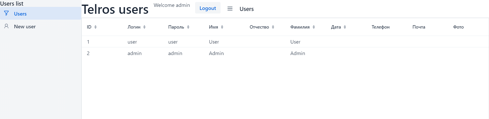
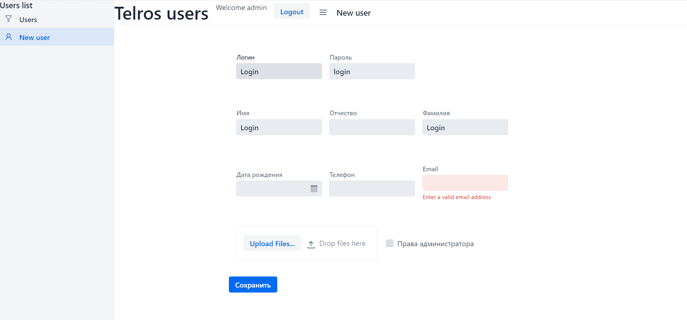
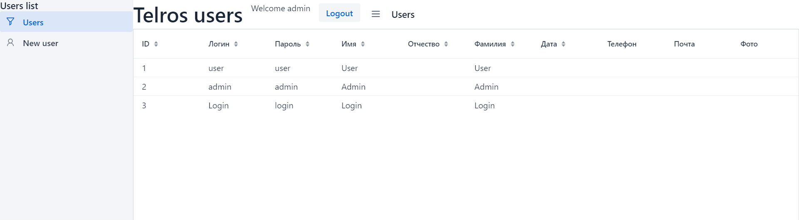

## Телрос Софт. тестовое задание.
### Разработано Web-приложение на Java с использованием фреймворков SpringBoot, Vaadin и БД PostgreSQL.
### При запуске приложения, пользователь с правами доступа USER не может получить доступ к общему списку, пользователь с правами ADMIN имеет доступ к списку всех пользователей, внесенных в БД, а также к странице добавления нового.

### Для запуска приложения необходимо создать пустую postgres таблицу users_list, а также проверить параметры username, password в application.properties.

